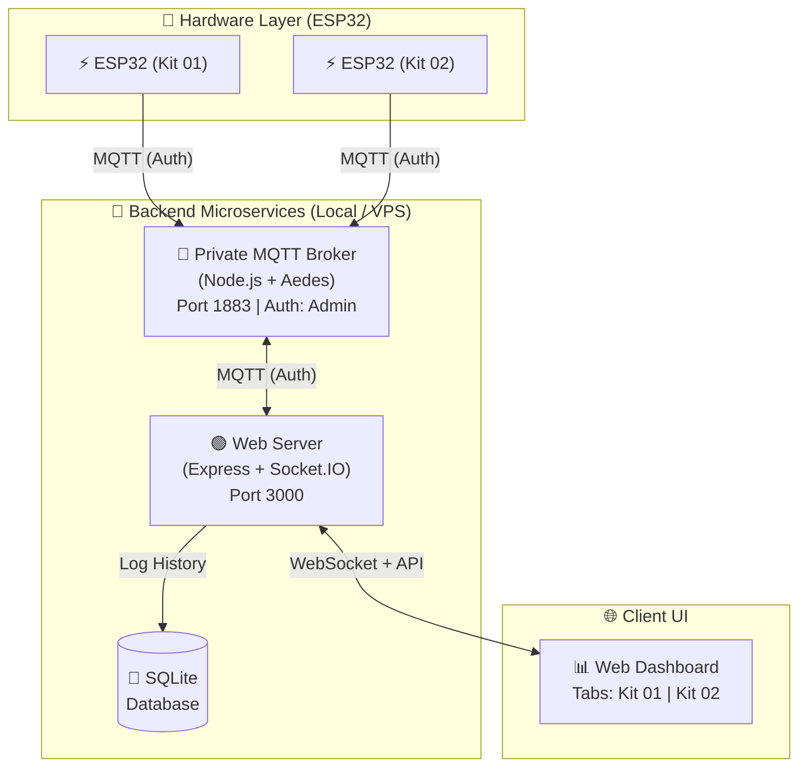

<h1 align="center">
  🔥 ESP32 Fire Alarm System (Microservices & Multi-Kit)
</h1>

<p align="center">
  <strong>Hệ Thống Báo Cháy Thông Minh — IoT Smart Fire Detection & Alert System</strong>
</p>

<p align="center">
  
  
  
  
  
</p>

<p align="center">
  <em>Hệ thống phát hiện cháy thời gian thực xây dựng theo kiến trúc Microservices. Tự host MQTT Broker bảo mật, quản lý đa thiết bị (Multi-Kit) độc lập với Web Dashboard điều khiển từ xa qua mã PIN.</em>
</p>

---

## 📋 Mục lục

- [Tổng quan](#-tổng-quan)
- [Tính năng nổi bật](#-tính-năng-nổi-bật)
- [Kiến trúc Microservices](#-kiến-trúc-hệ-thống--microservices)
- [Phần cứng](#-phần-cứng)
- [Cài đặt & Sử dụng](#-cài-đặt--sử-dụng)
- [Web Dashboard](#-web-dashboard)
- [MQTT Topics & API](#-mqtt-topics--api)
- [Tech Stack](#-tech-stack)

---

## 🌟 Tổng quan

**ESP32 Fire Alarm System** là đồ án hệ thống phát hiện và cảnh báo cháy thông minh. Hệ thống thiết kế theo kiến trúc **Microservices phân tán**, phân tách hoàn toàn Web Server và MQTT Broker để đảm bảo tính sẵn sàng cao, bảo mật chặt chẽ và dễ dàng mở rộng.

### Điểm nổi bật về mặt hệ thống

- 🏗️ **Kiến trúc Microservices**: Chạy song song độc lập **Web Server** (giao diện) và **MQTT Broker** (luồng dữ liệu IoT). Nếu Web Server bảo trì, kết nối IoT vẫn không bị ngắt.
- 🔒 **Tự host MQTT Broker (Aedes)**: Không dùng server công cộng. Tích hợp tính năng xác thực Username/Password để chống truy cập trái phép.
- 🏢 **Multi-Kit Management**: Giám sát và điều khiển nhiều ESP32 Kit độc lập trên cùng một màn hình điều khiển qua các Tab.
- 🔑 **Xác thực Mã PIN (Security PIN)**: Yêu cầu mã PIN an toàn khi người dùng thực hiện các thao tác nhạy cảm (Mở cửa thoát hiểm, Kích hoạt/Dừng báo động).
- 📡 **Offline Detection**: Hệ thống ping heartbeat liên tục, giao diện tự động khóa và làm mờ bảng điều khiển nếu ESP32 mất kết nối quá 30 giây.

---

## ✨ Tính năng nổi bật

| Nhóm | Tính năng | Mô tả |
|------|-----------|-------|
| **Cảm biến** | 🌡️ Đo nhiệt độ, độ ẩm<br>💨 Báo khí gas/CO<br>🔥 Phát hiện lửa | Dữ liệu cập nhật real-time. Cảnh báo chia làm 3 mức độ (Bình thường, Cảnh báo, Khẩn cấp). |
| **Báo động** | 🔊 Còi Hú & 💡 Đèn LED<br>🚪 Mở cửa tự động | Kích hoạt còi hú xoay chiều và tự động kéo Servo mở cửa thoát hiểm khi có hỏa hoạn. |
| **Giao diện** | 📊 Biểu đồ lịch sử<br>🗂️ Quản lý Đa Thiết bị | Web Dashboard thiết kế Premium Dark Theme, xem biểu đồ lịch sử cảm biến cho từng thiết bị riêng biệt. |
| **Điều khiển**| 🛡️ Bảo vệ qua PIN<br>🛑 Dừng báo động | Mọi thao tác khẩn cấp đều phải điền PIN (`1234`). Chế độ dừng cảnh báo giả từ xa. |

---

## 🏗️ Kiến trúc Hệ thống / Microservices



---

## 🔌 Phần cứng

| #   | Linh kiện          | Số lượng | Giao thức |
| --- | ------------------ | -------- | --------- |
| 1   | ESP32 DevKit C V4  | 1        |           |
| 2   | DHT22              | 1        | Digital   |
| 3   | MQ-2               | 1        | ADC       |
| 4   | Flame Sensor (IR)  | 1        | Digital   |
| 5   | Servo Motor (SG90) | 1        | PWM       |
| 6   | Buzzer, LED x2     | 3        | Digital   |

> 📖 Sơ đồ chân nối chi tiết: [docs/HARDWARE.md](docs/HARDWARE.md)

---

## 🚀 Cài đặt & Sử dụng

Hệ thống yêu cầu cài đặt **Node.js** (cho server) và **PlatformIO** (cho firmware).

### 1️⃣ Khởi chạy Private MQTT Broker (Microservice 1)

Broker nội bộ quản lý luồng dữ liệu IoT an toàn:

```bash
cd mqtt-broker
npm install
npm start
```
> Broker sẽ chạy ở cổng `1883`. User mặc định: `admin`, Password: `firealarm_secure_2026`

### 2️⃣ Khởi chạy Web Server (Microservice 2)

```bash
# Mở một Terminal MỚI
cd web-server
npm install
npm start
```
> Web chạy tại **http://localhost:3000**. Mã PIN điều khiển mặc định: `1234`.

### 3️⃣ Nạp firmware ESP32

Sửa file cấu hình WiFi và IP của MQTT Broker trong thư mục firmware trước khi nạp:
```bash
cd firmware
# Kết nối cáp USB và nạp code
pio run --target upload
```

> 📖 Xem cách đổi cấu hình/Mô phỏng Wokwi tại [docs/SETUP.md](docs/SETUP.md)

---

## 📊 Web Dashboard

Dashboard sở hữu thiết kế **Premium Dark Theme** sử dụng Glassmorphism.

- **Kit Tabs**: Chuyển đổi trạng thái, biểu đồ giữa nhiều ESP32.
- **Offline Overlay**: Nhận biết thiết bị mất mạng. Màn hình tự động làm mờ và khóa phím điều khiển.
- **Security Modal**: Mọi thao tác như "Mở cửa", "Kích hoạt báo động", "Dừng báo động" yêu cầu nhập PIN bảo mật.
- **Fire Level Bar**: Thanh đánh giá rủi ro an toàn tự động dựa trên quy tắc logic cảm biến (Ngưỡng khí gas + Ngưỡng nhiệt).

---

## 📡 MQTT Topics & API

Hỗ trợ Prefix Topic linh hoạt (ví dụ `nguyennhatminh_20225886/kit01/telemetry`).

| Topic (`{prefix}/{device_id}/*`) | Mô tả                   |
| -------------------------------- | ----------------------- |
| `.../telemetry`                  | ESP32 gửi dữ liệu cảm biến định kỳ |
| `.../status/door`                | ESP32 gửi phản hồi trạng thái thật của cửa (OPEN/CLOSED) |
| `.../led_control`                | Web Server ra lệnh (OPEN, CLOSE, STOP_ALARM) dưới dạng JSON |

> 📖 Xem toàn bộ Payload và API: [docs/API.md](docs/API.md)

---

## 🛠️ Tech Stack

- **Firmware:** C++ (Arduino Framework), PlatformIO
- **Microservices:** Node.js, Express, Aedes MQTT, Socket.IO
- **Database:** SQLite (sql.js)
- **Frontend:** Vanilla JS, CSS3, Chart.js 4.x
- **Hardware Simulation:** Wokwi

---

## 👨‍💻 Tác giả

<table>
  <tr>
    <td align="center">
      <strong>Nguyễn Nhật Minh</strong><br/>
      MSSV: 20225886<br/>
      📧 minh.nn225886@sis.hust.edu.vn<br/>
      🏫 Trường Công Nghệ Thông Tin Truyền Thông, ĐHBK Hà Nội (HUST)<br/>
      📚 Đồ án IoT — Học kỳ 20252
    </td>
  </tr>
</table>

---
<p align="center"><sub>Made with ❤️ at Hanoi University of Science and Technology</sub></p>
