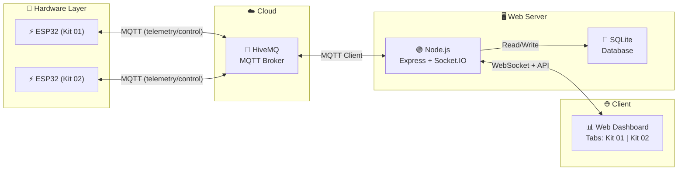

<h1 align="center">
  🔥 ESP32 Fire Alarm System (Multi-Kit)
</h1>

<p align="center">
  <strong>Hệ Thống Báo Cháy Thông Minh — IoT Smart Fire Detection & Alert System</strong>
</p>

<p align="center">
  
  
  
  
  
</p>

<p align="center">
  <em>Hệ thống phát hiện cháy thời gian thực hỗ trợ quản lý đa thiết bị (Multi-Kit) dùng ESP32. Tích hợp xác thực mã PIN bảo mật, kiểm tra kết nối ngoại tuyến và Web Dashboard điều khiển từ xa.</em>
</p>

---

## 📋 Mục lục

- [Tổng quan](#-tổng-quan)
- [Tính năng mới](#-tính-năng-mới-v2)
- [Kiến trúc hệ thống](#-kiến-trúc-hệ-thống)
- [Phần cứng](#-phần-cứng)
- [Cài đặt & Sử dụng](#-cài-đặt--sử-dụng)
- [Web Dashboard](#-web-dashboard)
- [MQTT Topics](#-mqtt-topics)
- [Cấu trúc dự án](#-cấu-trúc-dự-án)
- [Tech Stack](#-tech-stack)
- [Tác giả](#-tác-giả)

---

## 🌟 Tổng quan

**ESP32 Fire Alarm System** là hệ thống phát hiện và cảnh báo cháy thông minh sử dụng vi điều khiển ESP32, tích hợp nhiều loại cảm biến để đánh giá rủi ro theo **3 cấp độ**. 

Hệ thống đã được nâng cấp kiến trúc để hỗ trợ **Multi-Kit (Nhiều thiết bị)**, cho phép giám sát nhiều khu vực độc lập trên cùng một Dashboard. Các thao tác điều khiển nhạy cảm (như mở cửa, dừng báo động khẩn cấp) được bảo vệ thông qua **Mã PIN bảo mật (Security PIN)**.

### Điểm nổi bật

- 🏢 **Multi-Kit Management**: Giám sát và điều khiển nhiều ESP32 Kit độc lập qua giao diện Tab.
- 🔐 **Security PIN**: Yêu cầu mã bảo mật khi thực hiện tác vụ khẩn cấp (Mở cửa/Báo động).
- 📡 **Offline Detection**: Theo dõi heartbeat để tự động làm mờ và khóa điều khiển khi Kit mất kết nối mạng.
- 🔥 **Multi-sensor fusion**: Kết hợp cảm biến nhiệt độ, khí gas và lửa.
- 🎨 **Premium Dashboard**: Giao diện web dark theme, glassmorphism, và Chart.js.
- 🚪 **Remote Control**: Mở/đóng cửa thoát hiểm, bật/tắt/ngừng còi báo động từ xa.

---

## ✨ Tính năng mới (v2)

| Tính năng                     | Mô tả                                        |
| ----------------------------- | -------------------------------------------- |
| 🗂️ **Tab Đa Thiết Bị**        | Chuyển đổi qua lại giữa các Kit trực tiếp trên giao diện |
| 🛡️ **Xác thực Mã PIN**        | Modal nhập mã (mặc định: `1234`) trước khi gửi lệnh điều khiển nguy hiểm |
| 🛑 **Dừng báo động**          | Nút chuyên biệt để tắt báo động khi có cảnh báo giả |
| 🔌 **Trạng thái kết nối**     | Cảnh báo UI (Overlay Mờ) khi Kit bị ngắt kết nối quá 30 giây |
| 🌡️ **Đo nhiệt độ & độ ẩm**    | Cảm biến DHT22, đo liên tục mỗi 2 giây       |
| 💨 **Phát hiện khí gas/CO**   | Cảm biến MQ-2 với ngưỡng cảnh báo đa cấp     |
| 🚪 **Cửa thoát hiểm tự động** | Servo motor mở cửa tự động và thông báo trạng thái "Đang mở..." |

---

## 🏗️ Kiến trúc hệ thống



---

## 🔌 Phần cứng

### Danh sách linh kiện (Cho mỗi Kit)

| #   | Linh kiện          | Số lượng | Mô tả                     |
| --- | ------------------ | -------- | ------------------------- |
| 1   | ESP32 DevKit C V4  | 1        | Vi điều khiển chính       |
| 2   | DHT22              | 1        | Cảm biến nhiệt độ & độ ẩm |
| 3   | MQ-2               | 1        | Cảm biến khí gas/CO       |
| 4   | Flame Sensor (IR)  | 1        | Cảm biến phát hiện lửa    |
| 5   | Servo Motor (SG90) | 1        | Điều khiển cửa thoát hiểm |
| 6   | Buzzer             | 1        | Còi báo động              |
| 7   | LED Đỏ + Xanh      | 2        | Đèn cảnh báo              |

> 📖 Xem chi tiết tại [docs/HARDWARE.md](docs/HARDWARE.md)

---

## 🚀 Cài đặt & Sử dụng

### Yêu cầu

- **PlatformIO** (VS Code Extension)
- **Node.js** v18+ và npm

### 1️⃣ Chạy Web Server

```bash
cd web-server
npm install
npm start
```
Server chạy tại **http://localhost:3000**. Mật mã PIN bảo mật mặc định là `1234`.

### 2️⃣ Nạp firmware ESP32

Bạn có thể chạy dự án thông qua **Mô phỏng Wokwi** hoặc **Mạch phần cứng thực tế**. Hãy đọc file `platformio.ini` và [docs/REAL_HARDWARE_UPLOAD.md](docs/REAL_HARDWARE_UPLOAD.md) để biết chi tiết.

```bash
cd firmware
# Build & Upload (kết nối ESP32 qua USB)
pio run --target upload
```

> 📖 Hướng dẫn chi tiết tại [docs/SETUP.md](docs/SETUP.md)

---

## 📊 Web Dashboard

Dashboard được thiết kế với giao diện **premium dark theme**, bao gồm:

- **Kit Tabs**: Chuyển đổi dễ dàng giữa nhiều thiết bị.
- **Offline Overlay**: Làm mờ giao diện nếu thiết bị ngắt kết nối mạng.
- **Security Modal**: Popup glassmorphism yêu cầu nhập mã PIN.
- **Sensor Cards**: Hiển thị nhiệt độ, độ ẩm, khí gas với gauge animation.
- **History Chart**: Biểu đồ lịch sử độc lập cho từng Kit.

### Cấp độ báo cháy

| Cấp                        | Điều kiện                                               | Hành động                        |
| -------------------------- | ------------------------------------------------------- | -------------------------------- |
| 🟢 **Cấp 1 — Bình thường** | Tất cả cảm biến dưới ngưỡng                             | Không có hành động               |
| 🟡 **Cấp 2 — Cảnh báo**    | Khí gas > 1000 ppm HOẶC nhiệt > 40°C                    | Cảnh báo trên dashboard          |
| 🔴 **Cấp 3 — Khẩn cấp**    | Phát hiện lửa HOẶC (khí gas > 2000 ppm VÀ nhiệt > 50°C) | Mở cửa + Còi báo + LED nhấp nháy |

---

## 📡 MQTT Topics & API

Dự án hỗ trợ prefix độc lập cho từng thiết bị, ví dụ `nguyennhatminh_20225886/kit01/telemetry`.

| Topic (`{prefix}/{device_id}/*`) | Hướng          | Mô tả                   |
| -------------------------------- | -------------- | ----------------------- |
| `.../telemetry`                  | ESP32 → Server | Dữ liệu cảm biến (JSON) |
| `.../status/door`                | ESP32 → Server | Trạng thái thực của cửa |
| `.../control/door`               | Server → ESP32 | Lệnh mở/đóng cửa        |
| `.../control/emergency`          | Server → ESP32 | Bật/tắt khẩn cấp        |

### Server-to-Client WebSocket Payload

```json
{
  "deviceId": "kit01",
  "action": "OPEN_DOOR"
}
```

> 📖 Xem đầy đủ tại [docs/API.md](docs/API.md)

---

## 🛠️ Tech Stack

<table>
  <tr>
    <td align="center"><strong>Layer</strong></td>
    <td align="center"><strong>Technology</strong></td>
  </tr>
  <tr>
    <td>🔧 MCU</td>
    <td>ESP32 DevKit C V4</td>
  </tr>
  <tr>
    <td>📦 Firmware IDE</td>
    <td>PlatformIO (Arduino Framework)</td>
  </tr>
  <tr>
    <td>📡 Protocol</td>
    <td>MQTT (HiveMQ Public Broker)</td>
  </tr>
  <tr>
    <td>🖥️ Backend</td>
    <td>Node.js, Express, Socket.IO</td>
  </tr>
  <tr>
    <td>💾 Database</td>
    <td>SQLite (sql.js)</td>
  </tr>
  <tr>
    <td>🎨 Frontend</td>
    <td>HTML5, CSS3, JavaScript (Vanilla)</td>
  </tr>
  <tr>
    <td>🧪 Simulation</td>
    <td>Wokwi Simulator</td>
  </tr>
</table>

---

## 👨‍💻 Tác giả

<table>
  <tr>
    <td align="center">
      <strong>Nguyễn Nhật Minh</strong><br/>
      MSSV: 20225886<br/>
      📧 minh.nn225886@sis.hust.edu.vn<br/>
      🏫 Trường Công Nghệ Thông Tin Truyền Thông, ĐHBK Hà Nội (HUST)<br/>
      📚 Đồ án IoT — Học kỳ 20252
    </td>
  </tr>
</table>

---

<p align="center">
  <strong>⭐ Nếu project hữu ích, hãy cho một star! ⭐</strong>
</p>

<p align="center">
  <sub>Made with ❤️ at Hanoi University of Science and Technology</sub>
</p>
