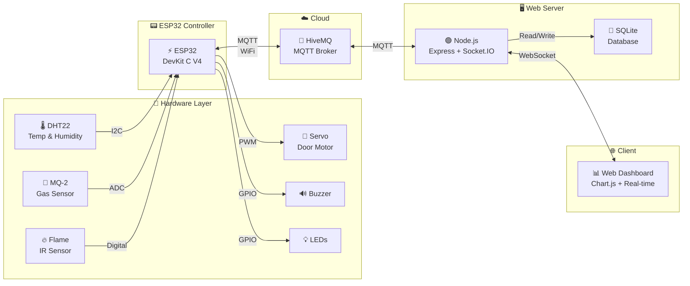

<h1 align="center">
  🔥 ESP32 Fire Alarm System
</h1>

<p align="center">
  <strong>Hệ Thống Báo Cháy Thông Minh — IoT Smart Fire Detection & Alert System</strong>
</p>

<p align="center">
  
  
  
  
  
</p>

<p align="center">
  <em>Real-time fire detection system using ESP32 with multi-sensor fusion, MQTT communication, and a premium web dashboard for remote monitoring & control.</em>
</p>

---

## 📋 Mục lục

- [Tổng quan](#-tổng-quan)
- [Tính năng](#-tính-năng)
- [Kiến trúc hệ thống](#-kiến-trúc-hệ-thống)
- [Phần cứng](#-phần-cứng)
- [Cài đặt & Sử dụng](#-cài-đặt--sử-dụng)
- [Web Dashboard](#-web-dashboard)
- [MQTT Topics](#-mqtt-topics)
- [Cấu trúc dự án](#-cấu-trúc-dự-án)
- [Tech Stack](#-tech-stack)
- [Tác giả](#-tác-giả)

---

## 🌟 Tổng quan

**ESP32 Fire Alarm System** là hệ thống phát hiện và cảnh báo cháy thông minh sử dụng vi điều khiển ESP32, tích hợp nhiều loại cảm biến để đánh giá rủi ro theo **3 cấp độ** (Bình thường → Cảnh báo → Khẩn cấp). Dữ liệu được truyền real-time qua MQTT đến web server Node.js, hiển thị trên dashboard premium với giao diện dark theme hiện đại.

### Điểm nổi bật

- 🔥 **Multi-sensor fusion**: Kết hợp cảm biến nhiệt độ, khí gas và lửa
- 📡 **Real-time monitoring**: Truyền dữ liệu liên tục qua MQTT
- 🎨 **Premium Dashboard**: Giao diện web dark theme với glassmorphism
- 📊 **Chart.js visualization**: Biểu đồ lịch sử cảm biến đẹp mắt
- 🚪 **Remote control**: Điều khiển cửa thoát hiểm và còi báo động từ xa
- 🔔 **3-level alert**: Phân loại mức độ nguy hiểm tự động

---

## ✨ Tính năng

| Tính năng                     | Mô tả                                        |
| ----------------------------- | -------------------------------------------- |
| 🌡️ **Đo nhiệt độ & độ ẩm**    | Cảm biến DHT22, đo liên tục mỗi 2 giây       |
| 💨 **Phát hiện khí gas/CO**   | Cảm biến MQ-2 với ngưỡng cảnh báo đa cấp     |
| 🔥 **Phát hiện lửa**          | Cảm biến hồng ngoại (IR flame sensor)        |
| 🚪 **Cửa thoát hiểm tự động** | Servo motor mở cửa khi khẩn cấp              |
| 🔊 **Còi báo động**           | Buzzer kích hoạt khi phát hiện cháy          |
| 💡 **LED cảnh báo**           | LED đỏ + xanh nhấp nháy xoay chiều           |
| 📊 **Dashboard real-time**    | Biểu đồ, gauge, nhật ký hoạt động            |
| 📱 **Điều khiển từ xa**       | Mở/đóng cửa, bật/tắt còi qua web             |
| 💾 **Lưu trữ dữ liệu**        | SQLite database lưu lịch sử cảm biến         |
| 🔗 **Wokwi Simulation**       | Mô phỏng trên Wokwi không cần phần cứng thật |

---

## 🏗️ Kiến trúc hệ thống



---

## 🔌 Phần cứng

### Danh sách linh kiện

| #   | Linh kiện          | Số lượng | Mô tả                     |
| --- | ------------------ | -------- | ------------------------- |
| 1   | ESP32 DevKit C V4  | 1        | Vi điều khiển chính       |
| 2   | DHT22              | 1        | Cảm biến nhiệt độ & độ ẩm |
| 3   | MQ-2               | 1        | Cảm biến khí gas/CO       |
| 4   | Flame Sensor (IR)  | 1        | Cảm biến phát hiện lửa    |
| 5   | Servo Motor (SG90) | 1        | Điều khiển cửa thoát hiểm |
| 6   | Buzzer             | 1        | Còi báo động              |
| 7   | LED Đỏ + Xanh      | 2        | Đèn cảnh báo              |
| 8   | Điện trở 330Ω      | 2        | Hạn dòng cho LED          |

### Sơ đồ kết nối (Pinout)

| Cảm biến / Thiết bị | Chân ESP32 | Giao thức              |
| ------------------- | ---------- | ---------------------- |
| DHT22 — DATA        | GPIO 15    | Digital                |
| DHT22 — VCC         | 3V3        | Power                  |
| MQ-2 — SIG          | GPIO 34    | ADC                    |
| MQ-2 — VCC          | 3V3        | Power                  |
| Flame Sensor — OUT  | GPIO 32    | Digital (INPUT_PULLUP) |
| Flame Sensor — VCC  | 3V3        | Power                  |
| Servo — PWM         | GPIO 18    | PWM                    |
| Servo — VCC         | 5V         | Power                  |
| Buzzer — PIN        | GPIO 4     | Digital                |
| LED Đỏ — Anode      | GPIO 2     | Digital (qua R330Ω)    |
| LED Xanh — Anode    | GPIO 19    | Digital (qua R330Ω)    |

> 📖 Xem chi tiết tại [docs/HARDWARE.md](docs/HARDWARE.md)

---

## 🚀 Cài đặt & Sử dụng

### Yêu cầu

- **PlatformIO** (VS Code Extension) hoặc PlatformIO CLI
- **Node.js** v18+ và npm
- **Wokwi Extension** (VS Code) — để mô phỏng

### 1️⃣ Clone repository

```bash
git clone https://github.com/YOUR_USERNAME/ESP32-Fire-Alarm-System.git
cd ESP32-Fire-Alarm-System
```

### 2️⃣ Nạp firmware ESP32

```bash
cd firmware

# Build & Upload (kết nối ESP32 qua USB)
pio run --target upload

# Hoặc mô phỏng với Wokwi (trong VS Code)
# Mở project → F1 → "Wokwi: Start Simulator"
```

### 3️⃣ Chạy Web Server

```bash
cd web-server

# Cài đặt dependencies
npm install

# Khởi chạy server
npm start
```

### 4️⃣ Mở Dashboard

Truy cập **http://localhost:3000** trên trình duyệt.

> 📖 Hướng dẫn chi tiết tại [docs/SETUP.md](docs/SETUP.md)

---

## 📊 Web Dashboard

Dashboard được thiết kế với giao diện **premium dark theme**, bao gồm:

- **Sensor Cards**: Hiển thị nhiệt độ, độ ẩm, khí gas với gauge animation
- **Flame Detector**: Indicator phát hiện lửa với ripple effect
- **History Chart**: Biểu đồ lịch sử cảm biến (Chart.js)
- **Fire Level Bar**: Thanh hiển thị cấp độ báo cháy (3 cấp)
- **Control Panel**: Điều khiển cửa thoát hiểm & kích hoạt khẩn cấp
- **Activity Log**: Nhật ký hoạt động real-time

### Cấp độ báo cháy

| Cấp                        | Điều kiện                                               | Hành động                        |
| -------------------------- | ------------------------------------------------------- | -------------------------------- |
| 🟢 **Cấp 1 — Bình thường** | Tất cả cảm biến dưới ngưỡng                             | Không có hành động               |
| 🟡 **Cấp 2 — Cảnh báo**    | Khí gas > 1000 ppm HOẶC nhiệt > 40°C                    | Cảnh báo trên dashboard          |
| 🔴 **Cấp 3 — Khẩn cấp**    | Phát hiện lửa HOẶC (khí gas > 2000 ppm VÀ nhiệt > 50°C) | Mở cửa + Còi báo + LED nhấp nháy |

---

## 📡 MQTT Topics

| Topic                                 | Hướng          | Mô tả                   |
| ------------------------------------- | -------------- | ----------------------- |
| `nguyennhatminh_20225886/telemetry`   | ESP32 → Server | Dữ liệu cảm biến (JSON) |
| `nguyennhatminh_20225886/led_control` | Server → ESP32 | Lệnh điều khiển         |

### Telemetry Payload

```json
{
  "temperature": 25.5,
  "humidity": 60.2,
  "smoke": 350,
  "flame": false,
  "level": 1
}
```

### Control Commands

```json
{"action": "OPEN_DOOR"}
{"action": "CLOSE_DOOR"}
{"action": "BUZZER_ON"}
{"action": "BUZZER_OFF"}
{"action": "LED_RED_ON"}
{"action": "LED_RED_OFF"}
{"action": "EMERGENCY_STOP"}
```

> 📖 Xem đầy đủ tại [docs/API.md](docs/API.md)

---

## 📁 Cấu trúc dự án

```
ESP32-Fire-Alarm-System/
├── 📄 README.md
├── 📄 LICENSE
├── 📄 .gitignore
│
├── 📁 firmware/                    ← ESP32 PlatformIO Project
│   ├── 📄 platformio.ini
│   ├── 📄 diagram.json            ← Wokwi simulation
│   ├── 📄 wokwi.toml
│   ├── 📁 src/
│   │   └── 📄 main.cpp            ← Firmware chính
│   ├── 📁 include/
│   └── 📁 lib/
│
├── 📁 web-server/                  ← Node.js Web Dashboard
│   ├── 📄 package.json
│   ├── 📁 src/
│   │   ├── 📄 server.js           ← Express + Socket.IO
│   │   ├── 📁 config/             ← Cấu hình MQTT & app
│   │   ├── 📁 database/           ← SQLite (sql.js)
│   │   ├── 📁 routes/             ← REST API
│   │   ├── 📁 services/           ← MQTT client
│   │   └── 📁 sockets/            ← WebSocket handlers
│   └── 📁 public/
│       ├── 📄 index.html          ← Dashboard UI
│       ├── 📁 css/                ← Premium dark theme
│       └── 📁 js/                 ← Chart.js + Socket.IO
│
└── 📁 docs/                       ← Tài liệu kỹ thuật
    ├── 📄 ARCHITECTURE.md
    ├── 📄 HARDWARE.md
    ├── 📄 API.md
    └── 📄 SETUP.md
```

---

## 🛠️ Tech Stack

<table>
  <tr>
    <td align="center"><strong>Layer</strong></td>
    <td align="center"><strong>Technology</strong></td>
  </tr>
  <tr>
    <td>🔧 MCU</td>
    <td>ESP32 DevKit C V4</td>
  </tr>
  <tr>
    <td>📦 Firmware IDE</td>
    <td>PlatformIO (Arduino Framework)</td>
  </tr>
  <tr>
    <td>📡 Protocol</td>
    <td>MQTT (HiveMQ Public Broker)</td>
  </tr>
  <tr>
    <td>🖥️ Backend</td>
    <td>Node.js, Express, Socket.IO</td>
  </tr>
  <tr>
    <td>💾 Database</td>
    <td>SQLite (sql.js)</td>
  </tr>
  <tr>
    <td>🎨 Frontend</td>
    <td>HTML5, CSS3, JavaScript (Vanilla)</td>
  </tr>
  <tr>
    <td>📊 Charts</td>
    <td>Chart.js 4.x</td>
  </tr>
  <tr>
    <td>🎭 Icons</td>
    <td>Phosphor Icons</td>
  </tr>
  <tr>
    <td>🔤 Fonts</td>
    <td>Inter, Space Grotesk (Google Fonts)</td>
  </tr>
  <tr>
    <td>🧪 Simulation</td>
    <td>Wokwi Simulator</td>
  </tr>
</table>

---

## 🧪 Mô phỏng với Wokwi

Project hỗ trợ mô phỏng trên [Wokwi](https://wokwi.com/) mà không cần phần cứng thật:

1. Mở thư mục `firmware/` trong VS Code
2. Cài extension **Wokwi Simulator**
3. Nhấn `F1` → chọn **"Wokwi: Start Simulator"**
4. Sơ đồ mạch sẽ tự động load từ `diagram.json`

---

## 👨‍💻 Tác giả

<table>
  <tr>
    <td align="center">
      <strong>Nguyễn Nhật Minh</strong><br/>
      MSSV: 20225886<br/>
      📧 minh.nn225886@sis.hust.edu.vn<br/>
      🏫 Trường Công Nghệ Thông Tin Truyền Thông, ĐHBK Hà Nội (HUST)<br/>
      📚 Đồ án IoT — Học kỳ 20252
    </td>
  </tr>
</table>

---

<p align="center">
  <strong>⭐ Nếu project hữu ích, hãy cho một star! ⭐</strong>
</p>

<p align="center">
  <sub>Made with ❤️ at Hanoi University of Science and Technology</sub>
</p>
