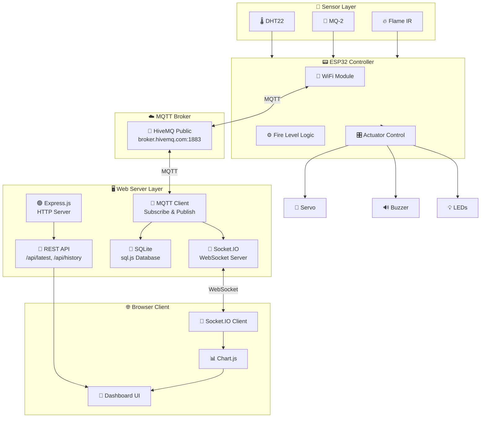
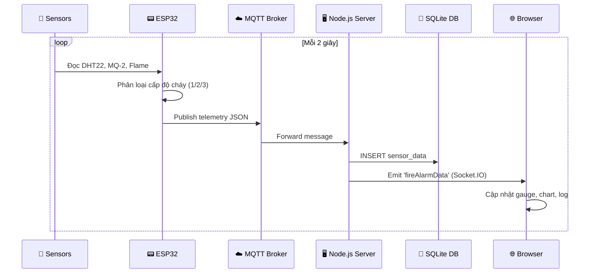
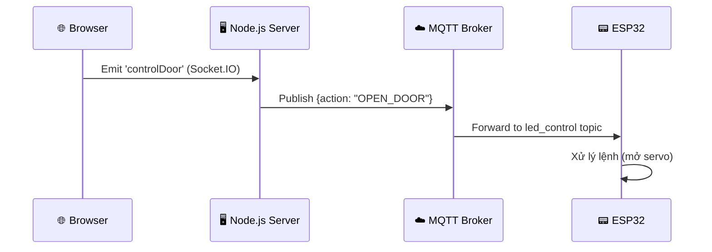
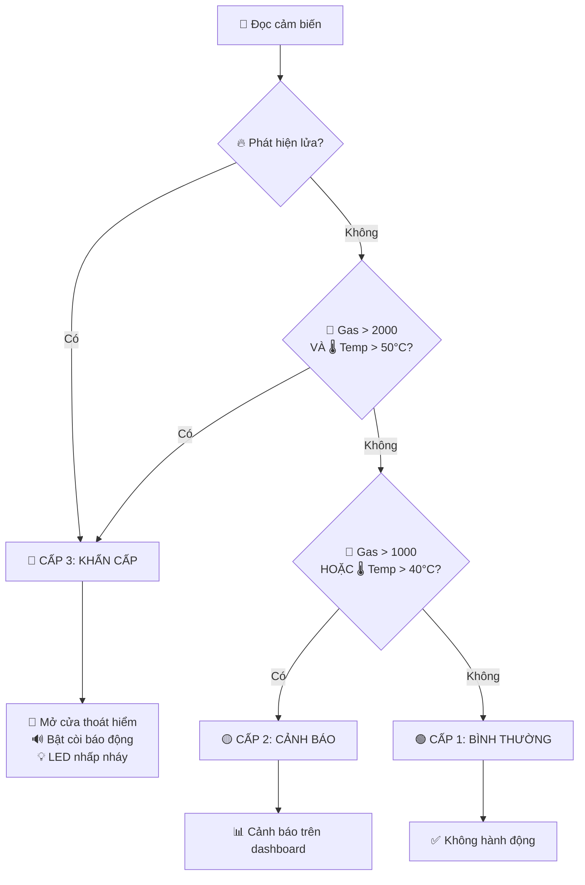

# 🏗️ Kiến trúc hệ thống — ESP32 Fire Alarm System

## Tổng quan kiến trúc

Hệ thống được chia thành **4 lớp** chính, giao tiếp qua giao thức MQTT:

## Luồng dữ liệu

### 1. Luồng telemetry (ESP32 → Dashboard)

### 2. Luồng điều khiển (Dashboard → ESP32)

## Phân loại cấp độ cháy

## Component Diagram

| Component | File | Chức năng |
|-----------|------|-----------|
| **ESP32 Firmware** | `firmware/src/main.cpp` | Đọc cảm biến, phân loại cấp cháy, MQTT publish/subscribe |
| **Web Server** | `web-server/src/server.js` | Khởi tạo Express, Socket.IO, kết nối modules |
| **MQTT Service** | `web-server/src/services/mqttService.js` | Kết nối MQTT broker, xử lý messages |
| **Database** | `web-server/src/database/db.js` | SQLite (sql.js) — lưu lịch sử cảm biến |
| **API Routes** | `web-server/src/routes/apiRoutes.js` | REST API endpoints |
| **Socket.IO** | `web-server/src/sockets/socketIO.js` | WebSocket handlers cho dashboard |
| **Dashboard** | `web-server/public/index.html` | Giao diện web premium |
| **Frontend JS** | `web-server/public/js/app.js` | Chart.js, gauge animation, Socket.IO client |
| **CSS Theme** | `web-server/public/css/style.css` | Dark theme với glassmorphism |
