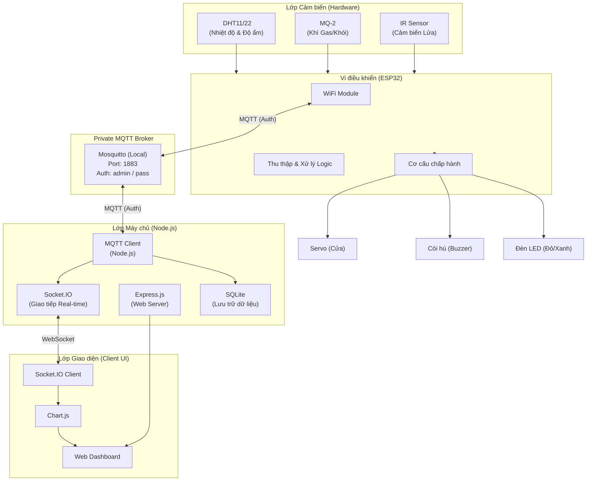
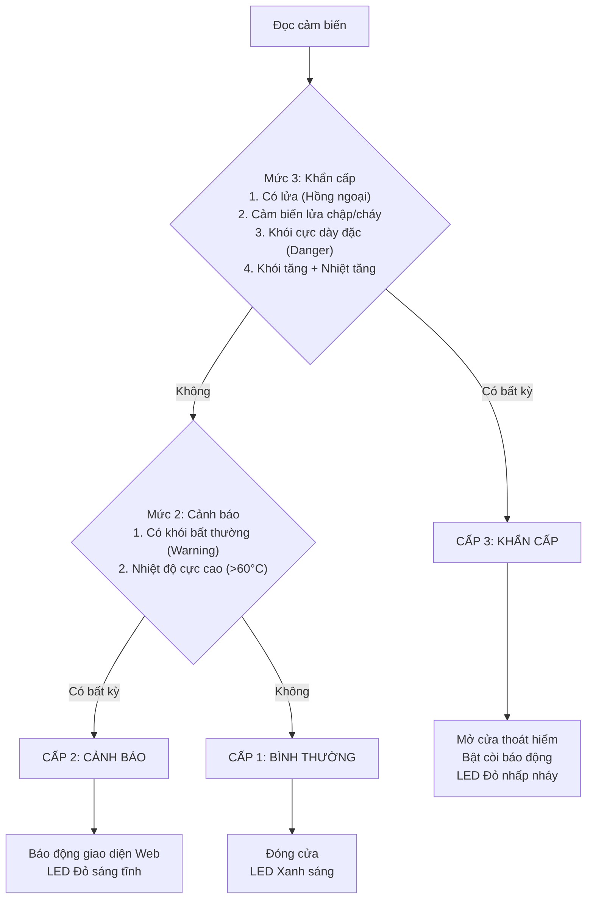

# ️ Kiến trúc hệ thống — ESP32 Fire Alarm System

Hệ thống được thiết kế theo kiến trúc **Microservices phân tán** và sử dụng giao thức **MQTT** làm xương sống để truyền tải dữ liệu theo thời gian thực. Hệ thống bao gồm 4 thành phần chính:

---

## 1. Sơ đồ Kiến trúc Tổng thể

---

## 2. Hoạt động của MQTT Broker (Mô hình Bưu điện)

Toàn bộ luồng dữ liệu (Telemetry) và luồng điều khiển (Control) đều đi qua **MQTT Broker (Mosquitto)** nội bộ. Để dễ hình dung, hãy coi MQTT Broker là một **Trạm Bưu Điện**.

1. **Trạm Bưu Điện (MQTT Broker)**: Nhận thư và chuyển phát thư dựa trên địa chỉ (Topic). Hệ thống bảo mật yêu cầu **Thẻ VIP (Username/Password)** để kết nối.
2. **Người Gửi (Publisher - ESP32)**: Định kỳ gửi dữ liệu cảm biến vào hòm thư (Ví dụ: `nguyennhatminh_20225886/telemetry`).
3. **Người Nhận (Subscriber - Web Server)**: Đăng ký nhận thư từ hòm `.../telemetry`. Cứ có dữ liệu mới, Bưu điện sẽ lập tức chuyển đến Web Server để lưu vào Database và đẩy lên Dashboard.

Ngược lại, khi bạn bấm nút trên Web Dashboard:
- Web Server sẽ ném một bức thư lệnh (VD: `{"action": "OPEN"}`) vào hòm thư `.../led_control`.
- Bưu điện lập tức báo cho ESP32. ESP32 nhận lệnh và điều khiển Motor/Còi hú.

---

## 3. Phân loại Cấp độ Cháy (Firmware Logic)

Logic đánh giá mức độ nguy hiểm được xử lý trực tiếp dưới ESP32 để đảm bảo độ trễ bằng 0.

---

## 4. Cấu trúc Thư mục & Vai trò

| Thành phần | File chính | Chức năng |
|-----------|------|-----------|
| **Cấu hình chung ESP32** | `firmware/include/config.h` | Quản lý Wi-Fi, IP Broker, Topic, cấu hình Cảm biến. |
| **Code nạp ESP32** | `firmware/src/main.cpp` | Đọc ADC/Digital từ cảm biến, đánh giá cháy, giao tiếp MQTT. |
| **Cấu hình Web Server** | `web-server/src/config/config.js` | Quản lý danh sách Kit ESP32, Port, Security PIN. |
| **Database** | `web-server/src/database/db.js` | Kết nối và thao tác lưu lịch sử với SQLite. |
| **MQTT Service** | `web-server/src/services/mqttService.js` | Nhận dữ liệu MQTT, lưu Database, theo dõi Heartbeat (Offline). |
| **WebSocket** | `web-server/src/sockets/socketIO.js` | Bắn dữ liệu Real-time (qua sự kiện `fireAlarmData`) xuống Client. |
| **Giao diện Web** | `web-server/public/index.html` | Thiết kế Glassmorphism giao diện người dùng. |
| **JS Giao diện** | `web-server/public/js/app.js` | Vẽ biểu đồ Chart.js, xử lý Popup mật khẩu PIN. |
