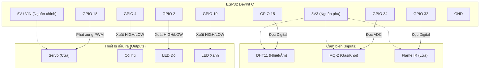

# Sơ đồ Phần cứng — ESP32 Fire Alarm System

Tài liệu này tổng hợp toàn bộ linh kiện điện tử, sơ đồ đấu dây và các ngưỡng báo động cấu hình sẵn trong Firmware của dự án.

---

## 1. Danh sách Linh kiện

| # | Tên linh kiện | Phân loại / Model | Số lượng | Mô tả chức năng chính |
|---|---------------|-------------------|----------|------------------------|
| 1 | Vi điều khiển | ESP32 DevKit C V4 | 1 | Bộ não xử lý trung tâm, tích hợp Wi-Fi. |
| 2 | Cảm biến Nhiệt/Ẩm | DHT11 (hoặc DHT22)| 1 | Đo lường nhiệt độ và độ ẩm môi trường. |
| 3 | Cảm biến Khí gas | MQ-2 | 1 | Phát hiện nồng độ khói, khí gas, CO rò rỉ. |
| 4 | Cảm biến Lửa | Flame Sensor (IR) | 1 | Phát hiện tia hồng ngoại từ ngọn lửa. |
| 5 | Động cơ Servo | SG90 | 1 | Đóng/Mở cửa thoát hiểm tự động. |
| 6 | Còi báo động | Active Buzzer 5V | 1 | Phát âm thanh cảnh báo khi có sự cố. |
| 7 | Đèn LED (Đỏ, Xanh) | LED 5mm | 2 | Hiển thị trạng thái an toàn / nguy hiểm. |

---

## 2. Bảng Đấu dây (Pinout)

### Cảm biến (Sensors)
| Linh kiện | Chân linh kiện | Chân ESP32 | Ghi chú |
|-----------|----------------|------------|---------|
| **DHT11** | VCC | 3V3 | Cấp nguồn 3.3V |
| | DATA (SDA) | **GPIO 15** | Nhận dữ liệu Digital |
| | GND | GND | Nối đất |
| **MQ-2** | VCC | 3V3 | Cấp nguồn 3.3V |
| | AO (Analog Out) | **GPIO 34** | Nhận giá trị ADC (0-4095). GPIO 34 là chân Input-Only |
| | GND | GND | Nối đất |
| **Flame** | VCC | 3V3 | Cấp nguồn 3.3V |
| | DO (Digital Out) | **GPIO 32** | Tín hiệu Digital. (Có lửa = LOW) |
| | GND | GND | Nối đất |

### Cơ cấu chấp hành (Actuators)
| Linh kiện | Chân linh kiện | Chân ESP32 | Ghi chú |
|-----------|----------------|------------|---------|
| **Servo** | VCC (Đỏ) | **5V (VIN)** | Servo cần dòng lớn, phải cấp nguồn 5V |
| | PWM (Cam) | **GPIO 18** | Tín hiệu điều khiển góc quay (PWM) |
| | GND (Nâu) | GND | Nối đất |
| **Buzzer** | + (VCC/IN) | **GPIO 4** | Kích hoạt còi hú |
| | - (GND) | GND | Nối đất |
| **LED Đỏ** | Anode (+) | **GPIO 2** | Nối qua điện trở 330Ω |
| | Cathode (-) | GND | Nối đất |
| **LED Xanh**| Anode (+) | **GPIO 19** | Nối qua điện trở 330Ω |
| | Cathode (-) | GND | Nối đất |

---

## 3. Sơ đồ Khối (Block Diagram)

---

## 4. Bảng Ngưỡng Cảnh Báo (Thresholds)

Hệ thống đánh giá mức độ nguy hiểm dựa trên các thông số cấu hình tại `firmware/include/config.h`:

| Cảm biến | Mức giá trị | Phân loại | Hành động hệ thống |
|----------|-------------|-----------|--------------------|
| **Khí Gas / Khói** (MQ-2) | Δ Tăng < 700 đơn vị | Bình thường | Giữ cửa đóng, LED Xanh sáng |
| | Δ Tăng từ 700 - 1400 | Cảnh báo | Báo động trên Web, LED Đỏ tĩnh |
| | Δ Tăng > 1400 | Nguy hiểm | Mở cửa, Hú còi, LED Đỏ nhấp nháy |
| **Nhiệt độ** (DHT11) | < 40°C | Bình thường | Giữ cửa đóng, LED Xanh sáng |
| | Từ 40°C - 50°C | Cảnh báo | Báo động trên Web, LED Đỏ tĩnh |
| | > 50°C | Nguy hiểm | Mở cửa, Hú còi, LED Đỏ nhấp nháy |
| **Cảm biến Lửa** (IR) | Tín hiệu HIGH | An toàn | Bỏ qua |
| | Tín hiệu LOW | PHÁT HIỆN LỬA | Mở cửa, Hú còi, Nháy LED ngay lập tức |

*(Lưu ý: Firmware áp dụng logic MQ2_AUTO_BASELINE. Khi khởi động, MQ-2 sẽ học giá trị khí nền trong 30 giây. Ngưỡng báo động tính bằng `Delta` (Giá trị hiện tại - Giá trị nền) thay vì dựa trên giá trị tuyệt đối).*
