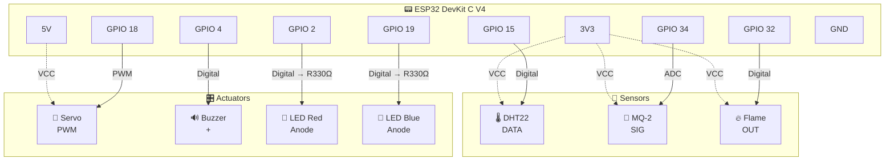

# 🔌 Hướng dẫn phần cứng — ESP32 Fire Alarm System

## Danh sách linh kiện

| # | Linh kiện | Model | Số lượng | Ghi chú |
|---|-----------|-------|----------|---------|
| 1 | Vi điều khiển | ESP32 DevKit C V4 | 1 | Dual-core, WiFi + Bluetooth |
| 2 | Cảm biến nhiệt độ & độ ẩm | DHT22 (AM2302) | 1 | Dải: -40~80°C, 0~100% RH |
| 3 | Cảm biến khí gas | MQ-2 | 1 | Phát hiện LPG, CO, CH4, khói |
| 4 | Cảm biến lửa | Flame Sensor (IR) | 1 | Bước sóng 760nm~1100nm |
| 5 | Servo motor | SG90 (hoặc tương đương) | 1 | Góc quay: 0~180° |
| 6 | Còi báo động | Active Buzzer 5V | 1 | Tần số cố định |
| 7 | LED đỏ | LED 5mm | 1 | Cảnh báo nguy hiểm |
| 8 | LED xanh | LED 5mm | 1 | Trạng thái hoạt động |
| 9 | Điện trở | 330Ω | 2 | Hạn dòng cho LED |
| 10 | Breadboard | MB-102 | 1 | Lắp mạch thử nghiệm |
| 11 | Dây jumper | Male-Male | ~20 | Kết nối linh kiện |

---

## Bảng Pinout chi tiết

### DHT22 — Cảm biến nhiệt độ & độ ẩm

| Chân DHT22 | Chân ESP32 | Mô tả |
|------------|-----------|-------|
| VCC | 3V3 | Nguồn 3.3V |
| DATA (SDA) | **GPIO 15** | Dữ liệu digital |
| GND | GND | Nối đất |

### MQ-2 — Cảm biến khí gas

| Chân MQ-2 | Chân ESP32 | Mô tả |
|-----------|-----------|-------|
| VCC | 3V3 | Nguồn 3.3V |
| SIG (Analog Out) | **GPIO 34** | Tín hiệu ADC (0-4095) |
| GND | GND | Nối đất |

> **Lưu ý**: GPIO 34 là chân chỉ đọc (input only), phù hợp với ADC.

### Flame Sensor — Cảm biến hồng ngoại

| Chân Flame | Chân ESP32 | Mô tả |
|------------|-----------|-------|
| VCC | 3V3 | Nguồn 3.3V |
| OUT | **GPIO 32** | Digital output (INPUT_PULLUP) |
| GND | GND | Nối đất |

> **Lưu ý**: Khi phát hiện lửa → OUT = LOW. Dùng `INPUT_PULLUP` để ổn định tín hiệu.

### Servo Motor — Cửa thoát hiểm

| Chân Servo | Chân ESP32 | Mô tả |
|------------|-----------|-------|
| VCC (đỏ) | **5V** | Nguồn 5V (servo cần 4.8-6V) |
| PWM (cam) | **GPIO 18** | Tín hiệu điều khiển PWM |
| GND (nâu) | GND | Nối đất |

> **Lưu ý**: Servo dùng nguồn 5V, KHÔNG dùng 3V3.

### Buzzer — Còi báo động

| Chân Buzzer | Chân ESP32 | Mô tả |
|-------------|-----------|-------|
| + (PIN) | **GPIO 4** | Tín hiệu điều khiển |
| - (GND) | GND | Nối đất |

### LED — Đèn cảnh báo

| LED | Chân ESP32 | Điện trở | Mô tả |
|-----|-----------|----------|-------|
| LED Đỏ (Anode) | **GPIO 2** | 330Ω nối tiếp | Cảnh báo nguy hiểm |
| LED Đỏ (Cathode) | GND | — | Nối đất |
| LED Xanh (Anode) | **GPIO 19** | 330Ω nối tiếp | Trạng thái hoạt động |
| LED Xanh (Cathode) | GND | — | Nối đất |

---

## Sơ đồ kết nối

---

## Ngưỡng cảm biến

| Cảm biến | Giá trị | Cấp độ |
|----------|---------|--------|
| MQ-2 (Gas) | 0 — 1000 ppm | 🟢 Bình thường |
| MQ-2 (Gas) | 1000 — 2000 ppm | 🟡 Cảnh báo |
| MQ-2 (Gas) | > 2000 ppm | 🔴 Nguy hiểm |
| DHT22 (Nhiệt) | < 40°C | 🟢 Bình thường |
| DHT22 (Nhiệt) | 40 — 50°C | 🟡 Cảnh báo |
| DHT22 (Nhiệt) | > 50°C | 🔴 Nguy hiểm |
| Flame Sensor | HIGH (no flame) | 🟢 An toàn |
| Flame Sensor | LOW (flame detected) | 🔴 PHÁT HIỆN LỬA |

---

## Wokwi Simulation

Project đã cấu hình sẵn cho mô phỏng trên Wokwi:

- **`diagram.json`**: Sơ đồ mạch với tất cả linh kiện
- **`wokwi.toml`**: Cấu hình firmware path
- **MQ-2** được mô phỏng bằng Potentiometer (xoay để thay đổi giá trị gas)
- **Flame Sensor** được mô phỏng bằng Slide Switch (bật/tắt để mô phỏng lửa)
